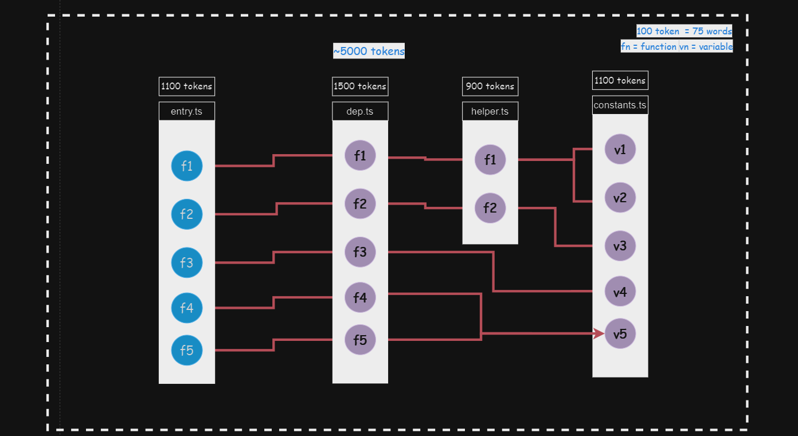
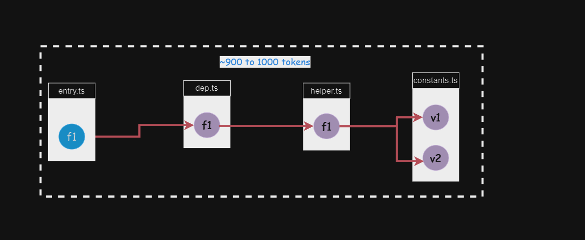

## Demo here 
##### Read the article [here](https://medium.com/@raiharsh88/is-4k-context-length-enough-93decf6c7093)
<video  autoply>
  <source src="./assets/demo2.mp4" type="video/mp4">
</video>

### Codebase


### Code chunk




## Usage 

##### Running the splitter


--entryFile <path_to_entry_file>: Path to the entry file.
--projectDir <path_to_project_directory>: Path to the project directory.
--aliasMap <map>: Alias map as a string representing a dictionary.
--testDir <path_to_test_directory>: Path to the test directory.
--fileExtension <File extension (ts)>


```bash
cd backend
ts-node argument_parser.js --entryFile "<path_to_entry_file>" --projectDir "<path_to_project_directory>" --aliasMap "{ '@src': '/home/harsh/chat-stocks/test_app/' }" --testDir "<path_to_test_directory>" --fileExtension 'ts'
```

##### Running llama_server

```bash
cd llama_server
python3 main.py
```


#### Cloud AMQP 
##### Signup on [Cloud AMQP](https://github.com/user/repo/blob/branch/other_file.md) and obtain the cloud amqp url

backend/.env
llama_server/.env

add the following config to both .env files
CLOUDMQTT_URL="you amqp url"
